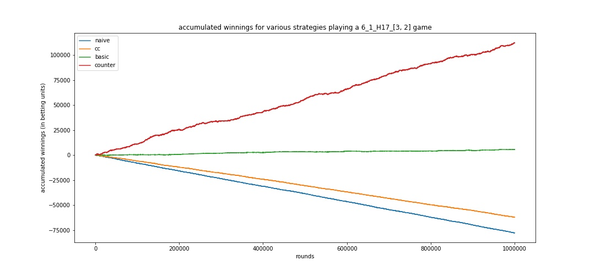
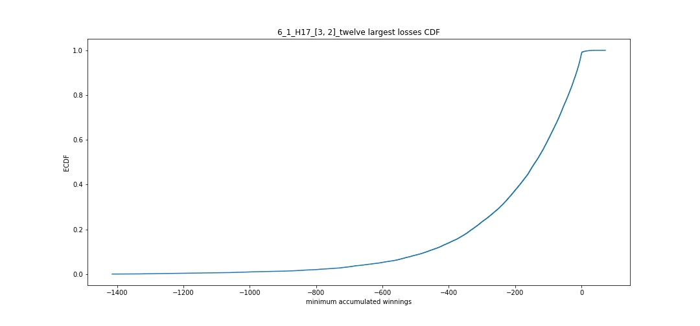

# BlackjackSimulator

## [0. Contents](#0._Contents) 

## [1. Introduction](#1._Introduction)
### [1.0. The game of blackjack](#1.0._The_game_of_blackjack)

### [1.1. Strategies](#1.1._Strategies)
 
### [1.2. Game parameters](#1.2._Game_parameters)

## [2. Simulator](#2._Simulator)

* ### [2.0. Pack class](#2.0.)

* ### [2.1. Player classes](#2.1.)

    * #### [2.1.0. Naive class](#2.1.0.)

    * #### [2.1.1. Copycat class](#2.1.1.)

    * #### [2.1.2. Basic class](#2.1.2.)

    * #### [2.1.3. Card Counter class](#2.1.3.)

* ### [2.2. Dealer class](#2.2.)

* ### [2.3. Game-play class](#2.3.)

* ### [2.4. Samples class](#2.4.)

## [3. Analysis](#3._Analysis)

* ### [3.0. Plot winnings for different strategies](#3.0.)

* ### [3.1. Largest Losses](#3.1.)

* ### [3.2. Correlation between opening count and total round winnings](#3.2.)

* ### [3.3. Correlation between change in opening count and total round winnings](#3.3.)

## [4. Machine Learning](#4._Machine_Learning)

* ### [4.0. Assembling sampled data](#4.0.)

* ### [4.1. Modeling](#4.1.)

## 1. Introduction

### 1.0 The game of blackjack

Blackjack is a casino game played between a player and the dealer.  While multiple players can play against a dealer simultaneously, each individual player's outcome only depends on their own cards and the dealer's. The point of the game is to have the highest value hand without exceeding 21.  The value of a hand is determined by its cards: 10s and face cards have value 10, cards 2-9 have value equal to their identity (e.g., a 4 card has value 4), and aces have value either 1 or 11--whichever is more advantageous). If a hand's value exceeds 21, it is said that the player or dealer 'busted'. To begin a round, the player places a bet, and the dealer deals the cards.  The player receives two cards face up; the dealer receives two cards, but only reveals one (called the dealer upcard) to the player.  The player takes the first turn. The player then chooses to either receive another card from the deck ('hit') or not receive one ('stand'). If the player busts, they automatically lose the round and their bet. If the player has finished their turn by standing, the dealer takes their turn.  The dealer follows a predetermined set of rules based solely on the dealer's hand:
* if the dealer's hand value is 16 or less, the dealer hits
* if the dealer's hand value is 17 or greater, the dealer stands
Special attention must be paid to what the dealer does on a soft 17: a hand containing an ace in which the hand value could either be 7 or 17.
* S17: this rule dictates that the dealer must stand on a soft 17.
* H17: this rule dictates that the dealer must hit on a soft 17 (H17 is less of an advantage for the player).
If the dealer busts (and the player hasn't busted, of course) then the player automatically wins the round, keeping their bet and earning an amount equal to their initial bet.  If neither the player nor the dealer has busted, then after the dealer's turn, whoever has a higher hand value wins the round.  If the dealer has a higher hand value than that of the player, the player loses the round and their bet.  If the dealer has a lower hand value than that of the player, the player wins the round, keeping their bet and earning an amount equal to their initial bet.  If both player and dealer have hands with the same value, it is said that the player 'pushes' and no money changes hands.

#### Blackjack:
In the game of blackjack, there is a certain kind of hand that is also called a Blackjack.  A Blackjack hand consists of two cards: an ace and 10-value card.  In other words, it is a two-card hand with the highest score possible: 21.  If a player is dealt a Blackjack, and the dealer does not also have a Blackjack, then they automatically win the round receiving a payout higher than the usual 1:1 ratio for standard wins.  Depending on the Blackjack table, this ratio can vary.  The most common ratios are 3:2 (win \$30 on a \$20 bet) and 6:5 (win \$24 on a \$20 bet).  If both player and dealer have Blackjacks, it is a push.  If the dealer has a Blackjack and the player does not, the player automatically loses the round and their bet. Losing to a dealer's Blackjack can sometimes be protected against by taking *insurance*.  If the dealer upcard is an ace, the player is offered to opportunity to take a side bet called 'insurance.'. Typically insurance pays 2:1 if the dealer ends up having a Blackjack.  So in practice, if a player wanted to accept the insurance offer, they would place an additional bet equal to one half of their original bet.  That way if the dealer has a Blackjack, the player loses no money. If the dealer does not have a Blackjack, the player loses their insurance side bet.

#### Double down:
At the beginning of a player's turn, before any additional cards have been received, they have the option to *double down* on their initial bet.  This entails doubling the amount of the initial bet and hitting exactly once (standing after just one hit).

#### Splitting:
Another option for the player is splitting.  Splitting is only available for hands where both cards have the same value.  The pair of cards is split to form the first card of two separate hands.  The dealer then deals to complete the two hands created by the split.  The player then plays both hands one at a time in succession.  Typically the maximum number of splits allowed is 3. It depends on the table whether or not a player can double down after splitting.  When both cards are aces, the player is often forced to stand immediately after the two separate hands are completed by the dealer (no opportunity to double down or even hit).  It depends on the table whehter or not a player can resplit aces.

### 1.1. Strategies

We discuss here four strategies that we consider in our simulator.

#### 1.1.1. Naive
The naive strategy is one where a player only hits when there is zero probability that they will bust.  That is, they hit on hands with values 11 or lower.  Otherwise, the player will stand.  Doubling down, splitting, and insurance are all ignored by this strategy. This is the worst strategy of the four considered.

#### 1.1.2. Copycat
The copycat strategy is one where the player plays just like the dealer: hit on 16 or lower, stand on 17 or higher.  Doubling down, splitting, and insurance are all ignored by this strategy. This is the second worst strategy of the four considered.

#### 1.1.3. Basic strategy
This is the standard strategy that would greatly benefit anyone wanting to put some effort into learning how to effectively play blackjack.  The strategy is based on the player's hand value and the dealer upcard.  A soft hand is one that can have two possible values due to the presence of an ace.  Basic strategy can be effectively laid out in a table, but we include it here as a list.  The list below indicates the action a player should take with a given hand value (before the colon) against the possible dealer upcards.

##### Hard totals:
* 17 and up: stand
* 13 through 16: stand against 2 through 6 otherwise hit
* 12: stand against 4 through 6 otherwise hit
* 11: always double down
* 10: double down against 2 through 9 otherwise hit
* 9: double down against 3 through 6 other wise hit
* 8 and down: hit

##### Soft totals:
* soft 20: stand
* soft 19: double down against 6 otherwise stand
* soft 18: double down against 2 through 6, stand against 7 and 8, hit against 9 and up
* soft 17: double down against 3 through 6, otherwise hit
* soft 16 and 15: double down against 4 through 6, otherwise hit
* soft 14 and 13: double down against 5 and 6, otherwise hit

##### Pairs:
* aces: always split
* tens: don't split
* nines: split against 2 through 9 except for 7
* eights: always split
* sevens: split against 2 through 7
* sixes: split against 2 through 6
* fives: never split
* fours: split against 5 and 6
* threes and twos: split against 2 through 7

Basic strategy has expected value extremely close to zero.  It is the best strategy for someone who wants to break even playing blackjack.

#### 1.1.4. Card counting
Card counting is a strategy that obtains a positive expected value for the player.  The driving principle of card counting is that as cards are dealt out of a shoe (pack of possibly multiple decks all shuffled together), the card values are not independent of one another (since we are dealing without replacement).  There are many versions of card counting strategies.  The strategy we will simulate is the Hi-Lo system of counting.  Over the course of multiple round, the card counter maintains a running count that is reset immediately after each shuffle.  When an ace or a 10-valued card is dealt, the running count decreases by 1; when a card of value 2 through 6 is dealt, the count increases by 1.  The count is unchanged by sevens, eights, and nines.  From the running count, the player computes the true count.  The true count is computed by dividing the running count by the estimated number of decks remaining in the shoe.  The player then makes strategy deviations and betting decisions based on the true count.  First the strategy deviations:

##### Pairs:
* tens: split against 4, 5, and 6 with true counts at least 6, 5, and 4 respectively

##### Soft totals:
* soft 19: double against 4 and 5 with true counts at least 3 and 1 respectively; stand against 6 with running count less than 0
* soft 17: double against 2 with true count at least 1

##### Hard totals:
* 16: stand against 9, 10, ace with true counts at least 4, 0, and 3 respectively
* 15: stand against 10 and ace with true counts at least 4 and 5 respectively
* 13: hit against 2 with true count -1 or less
* 12: stand against 2 and 3 with true counts at least 3 and 2 respectively; hit against 4 with running count less than 0
* 10: double down against 10 and ace with true counts at least 4 and 3 respectively
* 9: double down against 2 and 7 with true counts at least 1 and 3 respectively
* 8: double down against 6 with true count at least 2

##### Insurance:
* take insurance with true count at least 3

##### Betting decisions
The card counter's increase expected value is due in part to the above deviations and in part to betting different amounts of money based on the true count.  The general theme is the counter bets more when the true count is higher.  The counter typically goes into a blackjack session with a *bet spread* selected.  A bet spread is a predetermined scheme for how to bet based on the counts.  For example, a bet spread could be:

* true count -2 or lower: no bet (wait until a shuffle to play again)
* true count -1: one betting unit on one spot 
* true count 0: one betting unit on one spot
* true count 1: one betting unit on two spots
* true count 2: four betting units on two spots
* true count 3: six betting units on two spots
* true count 4: eight betting units on two spots
* true count 5: ten betting units on two spots
* true count 6: twelve betting units on two spots

Here, a betting unit is some amount of money such that the player is comfortable with the associated risk.  For example, if the betting unit is \$10 then ten betting units would be \$100.  The distinction between one and two spots indicates if the player will play one hand at a time (one spot) or play two hands simultaneously (two spots) for each round.  So ten betting units on two spots with a betting unit of \$10 would mean that the player is betting \$200 for that round.

This strategy always gives a positive expected value which depends on the bet spread and the game parameters.

### 1.2. Game parameters

The game parameters we consider in this project are as follows:

* Number of decks: most typical options are 2, 4, and 6
* Penetration: this indicates how much of the shoe (combination of decks in play) is played before the dealer shuffles.  The penetration is given by the threshold number of decks left in the shoe that triggers a shuffle.  For example, if the penetration is equal to 1, then the dealer will shuffle when there is approximately 1 deck's worth of cards remaining in the shoe.  The penetrations we will consider are 0.5, 1, 1.5, and 2.  Lower penetrations are more advantageous for card counters as we will see from the simulator data.
* Seventeen: this indicates if the dealer will play S17 or H17 rules as discussed above.
* Blackjack payout: this is the ratio at which a blackjack for the player pays.  The two values we will consider are 3:2 and 6:5.

## 2. Simulator

In [this notebook](https://github.com/scatkinson/BlackjackSimulator/blob/main/BJ_game_finite_deck.ipynb) we build a Blackjack simulation engine using object oriented programming in python.

### 2.0. Pack class

This class manages the shoe of the game.  The one input parameter is the number of decks in use. Contents:

* `fresh_pack` method: produces a freshly shuffled shoe
* `deal` method: removes a dealt card from the shoe
* `card` method: selects a card from the current state of the shoe at random based on the distribution of the current shoe
* `rc` method: gives the running count of the current state of the shoe
* `tc` method: gives the true count of the current state of the shoe
* `card_total` method: gives the total number of cards in the current shoe

### 2.1. Player classes

For each strategy mentioned above there is a corresponding class. All classes are passed the following parameters: `hands` (number of hands), `top` (top card shown by dealer), `bet` (bet value--set to 1, but can be changed), `spots` (number of spots played--set to 1 but can be changed--is changed by Card Counter class), `shoe` (shoe class to connect the player's turn to the current show) 

#### 2.1.0. Naive class

Contents:

* `Spots` method: returns the number of spots being played (always 1 for naive)
* `betting` method: reuturns the number of betting units wagered (always 1 for naive)
* `hit` method: deals the player another card from the shoe
* `stand` method: indicates the player stands
* `result` method: initiates the list of results for the player
* `is_soft` method: checks if the hand is soft
* `p_turn` method: initiates the steps for the player's turn. Checks for Blackjacks. If no Blackjacks then calls the `p_strat` method.
* `p_strat` method: implements the player's Naive strategy

#### 2.1.1. Copycat class

Contents:

* `Spots` method: returns the number of spots being played (always 1 for copycat)
* `betting` method: reuturns the number of betting units wagered (always 1 for copycat)
* `hit` method: deals the player another card from the shoe
* `stand` method: indicates the player stands
* `result` method: initiates the list of results for the player
* `is_soft` method: checks if the hand is soft
* `p_turn` method: initiates the steps for the player's turn. Checks for Blackjacks. If no Blackjacks then calls the `p_strat` method.
* `p_strat` method: implements the player's Copycat strategy

#### 2.1.2. Basic class

Contents:

* `Spots` method: returns the number of spots being played (always 1 for basic)
* `betting` method: reuturns the number of betting units wagered (always 1 for basic)
* `hit` method: deals the player another card from the shoe
* `double` method: called when the player doubles down (doubles bet initiated by `betting` method)
* `split` method: called when the player splits a hand
* `split_test` method: checks if the max number of splits (3) has been exceeded
* `is_pair` method: checks if the hand is eligible for a split
* `stand` method: indicates the player stands
* `result` method: initiates the list of results for the player
* `is_soft` method: checks if the hand is soft
* `p_turn` method: initiates the steps for the player's turn. Checks for Blackjacks. If no Blackjacks then calls the `p_strat` method.
* `p_strat` method: implements the Basic strategy

#### 2.1.3. Card counter class

This class is passed some additional parameters: `spread` (the counter's bet spread) and `opening_count` (the opening count of the shoe). Contents:

* `Spots` method: returns the number of spots being played (determined by bet spread)
* `betting` method: reuturns the number of betting units wagered (determined by bet spread)
* `hit` method: deals the player another card from the shoe
* `double` method: called when the player doubles down (doubles bet initiated by `betting` method)
* `split` method: called when the player splits a hand
* `split_test` method: checks if the max number of splits (3) has been exceeded
* `is_pair` method: checks if the hand is eligible for a split
* `stand` method: indicates the player stands
* `result` method: initiates the list of results for the player
* `is_soft` method: checks if the hand is soft
* `p_turn` method: initiates the steps for the player's turn. Checks for Blackjacks. If no Blackjacks then calls the `p_strat` method.
* `p_strat` method: implements the Card Counter strategy

### 2.2. Dealer class 

This class manages the play of the dealer.  The parameters are as follows: `hand` (the dealer's hand), `shoe` (the state of the current shoe), and `seventeen` (determines if the dealer is playing S17 or H17). Contents:

* `is_soft` method: checks if the dealer's hand is soft
* `hit` method: deals another card to the dealer
* `result` method: initiates the dealer's result list
* `d_turn` method: carries out the steps for the dealear's turn and returns the result of that turn

### 2.3. Game-play class

This class carries out the process of a round of blackjack.  Parameters: `shoe` (the state of the current shoe), `pen` (the penetration of the shoe), `strategy` (the strategy used by the player), `seventeen` (the seventeen rule played by the dealer: S17 or H17), `BJpays` (the ratio at which a Blackjack pays--3:2 or 6:5), `spread` (the bet spread of the carde counter if that is the strategy being used by the player). Contents:

* `fill_shoe` method: deals a fresh shoe
* `BJratio` method: establishes the `BJpays` ratio as a fraction
* `round` method: carries out the steps of a round of blackjack. Check if a shuffle is need (if the amount of cards has fallen below the threshold set by `pen`). Instantiate the dealer and player class. Record `opening_count`. Deal out cards in proper order: player, dealer, player, dealer. Assign dealer's top card for player class. Establish player bet. Initiate player result, split count, and double down lists.  Initiate `insurance` value (`False`); offer player insurance if dealer's top card is an ace. Check for Blackjacks. Call `p_turn` method on player class. Record player winnings.  Return winnings and dictionary containing `opening_count`, `cards_left`, `spots` played, `player_bets`, `double_down`, `player_hands`, `dealer_hand`, `player_results`, `dealer_result`, `insurance`, `player_winnings_by_hand`, `total_round_winnings`.
* `outcome` method: iterprets the player and dealer results to compute the payout for the player. Returns `winnings_by_hand`.

### 2.4. Samples class

This class runs the simulations of a blackjack game.  Parameters: `shoe` (current shoe), `pen` (penetration to be played), `strategies` (list of strategies to be sampled), `seventeen` (which seventeen rule the dealer plays), `num_players` (number of players at the table--always set to 1 but can be changed), `num_rounds` (number of rounds to be played), `BJpays` (Blackjack payout ratio), `spread` (card counter's bet spread). Contents:

* `data_table` method: produces a Pandas DataFrame with `num_rounds` entries for each strategy in the `strategies` list.  Each row corresponds to a round of blackjack.  Columns: `decks`, `pen`, `Blackjack_pays`, `Dealer_seventeen`, `strategy`, `spread`, `opening_count`, `cards_left`, `spots`, `bets`, `double_down`, `player_hands`, `dealer_hands`, `player_results`, `dealer_results`, `insurance`, `player_winnings_by_hand`, `total_round_winnings`.  This is the method used to produce the data frames for the non-counter classes for each combination of game parameters considered.

* `data_table_counter` method: similarly produces a Pandas DataFrame with `num_rounds` entries for a counter strategy with the bet spread passed to the `samples` class.  Each row corresponds to a round of blackjack.  The columns are the same as the columns from the `data_table` method with additional columns indicating the bet and number of spots for each true count -1 through 6 as indicated by the `spread` parameter.

### 2.5. Game parameters list  and sample collection

We then create a list called `product` listing all tuples of game parameters as indicated in [Section 1.2](#1.2._Game_parameters) (except no games with 2 decks and pen 2 are played sampled for obvious reasons).  This list containes 44 distinct tuples. We loop over this list using `data_table` with 1,000,000 rounds to produce 44 DataFrames for each non-counter strategy.  

Next we create a dictionary containing 20 different bet spreads for the counter strategy.  We loop over each bet spread and the 44 tuples of game parameters to produce 880 DataFrames, each with 1,000,000 rounds of blackjack.  

These 924 DataFrames (924,000,000 rounds of blackjack) will serve as the raw data for our analysis and training and testing for our predictive models.

These files are too large to upload to GitHub, so smaller (25,000 samples each) DataFrames have been uploaded under the [short_samples](https://github.com/scatkinson/BlackjackSimulator/tree/main/short_samples) directory.

## 3. Analysis

We perform some analysis on the data obtained from the simulator in [this notebook](https://github.com/scatkinson/BlackjackSimulator/blob/main/BlackjackAnalysis.ipynb). Throughout the notebook, we use the following game parameters for the sake of illustration:
* 6 decks
* penetration 1
* dealer plays H17
* Blackjack pays 3:2

### 3.0. Plot winnings for different strategies

For the above game parameters, we plot the accumulated winnings over 1,000,000 rounds for each of the following strategies:
* naive
* copycat
* basic
* counter (twelve spread)

### 3.1. Largest losses

We define a function `losses` that samples a random collection of 50,000 consecutive rounds from a given strategy dataframe 100,000 times to obtain the distribution of the most amount of money (in terms of betting units) a player can expect to lose.  The function returns the array of losses (length 100,000) and displays a boxplot, histogram/probability density function, and cumulative density function for the distribution of losses.  Here is the plot of the cumulative density function for the distribution of losses for a twelve-spread counter strategy:

### 3.2. Correlation between opening count and total round winnings

We investigate the correlation between opening count and total round winnings for basic strategy.  For the above game parameters, the Pearson correlation coefficient is $0.0137964008461712$ with p-value $2.6553296900597143\text{e}-43$.  This indicates that a positive count works in the player's favor (when playing basic strategy).

### 3.3. Correlation between change in opening count and total round winnings

The above analysis indicates that a positive opening count is advantageous for the basic player.  In this subsection we investigate the correlation between the change in the opening count and total round winnings for various strategies.  Under the same game parameters the Pearson correltation coefficient for the change in the opening count and the total round winnings is $-0.048813587654906156$ with p-value $0$.  What this analysis shows is that a decrease in count is actually what is advantageous for the players--the more 10-value cards and aces dealt, the better off the player is. Thus a positive count is advantageous for the player because we are using a balanced counting system, so a positive count is more likely to decrease.  See the following regressed scatter plot for these two variables:

    

## 4. Machine Learning

We develop models to predict expected values and losses depending on game parameters and bet spreads in [this notebook](https://github.com/scatkinson/BlackjackSimulator/blob/main/BlackjackML.ipynb).

### 4.0. Assembling sampled data

We take the sampled data and assemble it into a DataFrame where each entry is a game parameter and bet spread combination.  In addition to the features for the parameters and spread, the dataframe also has columns for probability of winning, expected value, probabiliyt of winning on a positive count, expected value for a positive count, and the fifth percentile of the corresponding distribution of losses (as negative numbers).  This portion is currently in process.

### 4.1. Modeling

When section 4.0. is complete, we will fit models to the obtained summary DataFrame. Coming soon.

